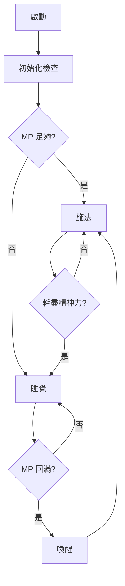
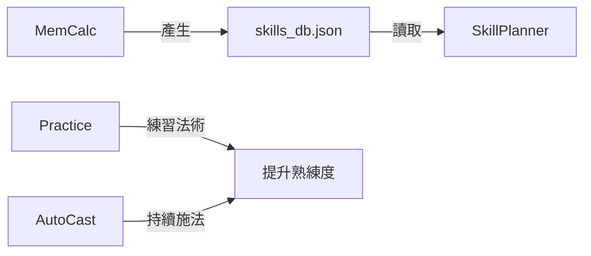

# 腳本使用手冊

本文件說明 MUD 客戶端內建的 Lua 腳本功能。

---

## 目錄

1. [AutoCast - 自動練功](#autocast---自動練功)
2. [Practice - 法術練習](#practice---法術練習)
3. [MemCalc - 記憶點數計算機](#memcalc---記憶點數計算機)
4. [SkillPlanner - 技能配置規劃](#skillplanner---技能配置規劃)

---

## AutoCast - 自動練功

自動施法練習腳本，會持續施法直到耗盡精神力，然後自動睡覺等待恢復。

### 載入
```lua
/lua dofile("scripts/autocast.lua")
```

### 指令

| 指令 | 說明 |
|------|------|
| `AutoCast.start("cast 'spell' target")` | 開始自動施法 |
| `AutoCast.stop()` | 停止自動施法 |
| `AutoCast.status()` | 顯示目前狀態 |

### 運作流程



### 偵測訊息

- **耗盡精神力**：進入睡眠模式
- **你正在睡覺耶**：嘗試喚醒
- **精神力 X/Y**：檢查 MP 是否回滿

### 使用範例

```lua
-- 練習召喚術
/lua AutoCast.start("cast 'sum' boy")

-- 練習治癒術
/lua AutoCast.start("cast 'heal' self")

-- 停止
/lua AutoCast.stop()
```

---

## Practice - 法術練習

自動掃描未滿 99% 的法術並輪流練習。

### 載入
```lua
/lua dofile("scripts/practice.lua")
```

### 指令

| 指令 | 說明 |
|------|------|
| `Practice.scan()` | 掃描可練習的法術 |
| `Practice.start()` | 開始自動練習 |
| `Practice.stop()` | 停止練習 |
| `Practice.status()` | 顯示狀態與法術列表 |
| `Practice.prev()` / `Practice.next()` | 切換當前法術 |
| `Practice.target("name")` | 設定施法目標 |
| `Practice.object("item")` | 設定物品目標 |

### 法術類型

| 類型 | 說明 | 施法格式 |
|------|------|----------|
| `target` | 對目標施法 | `cast 'spell' <target>` |
| `self` | 對自己施法 | `cast 'spell'` |
| `object` | 對物品施法 | `cast 'spell' <object>` |

### 特殊處理

如果某些法術的 `help` 指令會衝突（例如 `sleep`），可以加到已知類型表：

```lua
_G.Practice.known_spell_types = {
    ["sleep"] = "target",
    ["soulsteal"] = "target",
}
```

### 使用範例

```lua
-- 掃描並開始練習
/lua Practice.scan()
/lua Practice.start()

-- 設定目標為 student
/lua Practice.target("student")
```

---

## MemCalc - 記憶點數計算機

計算技能/法術的總記憶點數需求，支援自動掃描相依性和相斥性。

### 載入
```lua
/lua dofile("scripts/memcalc.lua")
```

### 指令

| 指令 | 說明 |
|------|------|
| `MemCalc.spell("name")` | 查詢法術（含相依樹） |
| `MemCalc.skill("name")` | 查詢技能（含相依樹） |
| `MemCalc.scan_all()` | 快速掃描所有技能/法術列表 |
| `MemCalc.scan_full()` | 完整掃描（含相依性和相斥性） |
| `MemCalc.stop_scan()` | 停止掃描 |
| `MemCalc.save()` | 儲存資料到 `data/skills_db.json` |

### 資料庫格式

```json
{
  "holy arrow": {
    "cost": 450,
    "is_spell": true,
    "dependencies": ["basic magic", "archery"],
    "exclusions": []
  },
  "two weapon": {
    "cost": 600,
    "is_spell": false,
    "dependencies": ["enhanced damage"],
    "exclusions": ["swordmaster", "kaioken"]
  }
}
```

### 掃描流程

**快速掃描 `scan_all()`：**
- 發送 `spell all` 和 `skill all`
- 只收集名稱和記憶點數
- 約 15 秒完成

**完整掃描 `scan_full()`：**
- 第一階段：收集所有技能名稱
- 第二階段：逐一查詢每個技能的相依/相斥
- 約 7 分鐘完成（200 個技能）

### 使用範例

```lua
-- 查詢單一法術的完整相依樹
/lua MemCalc.spell("holy arrow")

-- 完整掃描所有技能
/lua MemCalc.scan_full()
-- (掃描期間請按 Enter 翻頁)

-- 儲存資料
/lua MemCalc.save()
```

---

## SkillPlanner - 技能配置規劃

規劃記憶點數分配，自動處理相依性和相斥性衝突。

### 載入
```lua
/lua dofile("scripts/skillplanner.lua")
```

### 指令

| 指令 | 說明 |
|------|------|
| `SkillPlanner.load()` | 載入技能資料庫 |
| `SkillPlanner.budget(points)` | 設定記憶點數上限 |
| `SkillPlanner.add("skill")` | 加入技能（自動加入相依） |
| `SkillPlanner.remove("skill")` | 移除技能 |
| `SkillPlanner.clear()` | 清空選擇 |
| `SkillPlanner.plan()` | 顯示配置結果 |
| `SkillPlanner.suggest()` | 建議可加入的技能 |
| `SkillPlanner.deps("skill")` | 查看技能的相依樹 |
| `SkillPlanner.list()` | 列出所有已知技能 |

### 相依性處理

當加入一個技能時，會自動加入所有相依技能：

```lua
/lua SkillPlanner.add("holy arrow")
-- ✅ 加入技能: holy arrow
--    📎 自動加入相依技能:
--       - basic magic (50)
--       - archery (100)
```

### 相斥性處理

如果選擇的技能與已選技能相斥，會阻止加入：

```lua
/lua SkillPlanner.add("two weapon")
-- ❌ 無法加入 two weapon，有相斥衝突:
--    ⚔️ two weapon 與 swordmaster 相斥
```

### 使用範例

```lua
-- 完整規劃流程
/lua SkillPlanner.load()
/lua SkillPlanner.budget(85)

/lua SkillPlanner.add("heal")
/lua SkillPlanner.add("sanctuary")
/lua SkillPlanner.add("enhanced damage")

/lua SkillPlanner.plan()
/lua SkillPlanner.suggest()
```

---

## 腳本相互關係



1. **MemCalc** 收集技能資料並儲存到 `skills_db.json`
2. **SkillPlanner** 讀取資料庫進行配置規劃
3. **Practice** 自動練習未滿的法術
4. **AutoCast** 持續施法練習特定技能

---

## 常見問題

### Q: 掃描時資料不正確？
確保掃描期間按 Enter 翻頁，讓所有技能都能被讀取。

### Q: Practice.scan() 沒有找到某個法術？
檢查是否是 help 名稱衝突，如果是，加到 `Practice.known_spell_types` 表中。

### Q: SkillPlanner 載入失敗？
請先用 `MemCalc.scan_full()` 或 `MemCalc.scan_all()` 收集資料，再 `MemCalc.save()` 儲存。
